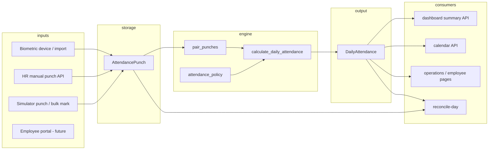

# Attendance System — Stabilization & End-to-End Audit Report

**Audit date:** 2026-06-04  
**Scope:** HR attendance module (`AttendancePunch` → calculation engine → `DailyAttendance` → dashboard / calendar / control surfaces)  
**Method:** Code tracing, `python manage.py check`, unit tests (policy/timezone), live DB scenario script (`scripts/attendance_audit_scenarios.py`), production DB dashboard reconciliation for today.

**Instruction honored:** Findings only — no automatic code changes in this audit.

---

## Executive summary

| Area | Verdict |
|------|---------|
| Core calculation engine (status, late, half-day, open checkout) | **PASS** (verified scenarios) |
| Timezone / punch wall-clock policy | **PASS** (unit tests + `Asia/Kolkata`) |
| Dashboard ↔ `DailyAttendance` (today, dev DB) | **PASS** (counts aligned) |
| Punch pairing / invalid sequence handling (engine) | **PASS** |
| Punch sequence blocking (API / simulator) | **FAIL** (allows bad taps; engine recovers) |
| CI / full `manage.py test` | **FAIL** (migration `hr.0026` / `Employee.email`) |
| Holiday / weekend automation | **FAIL** (not engine-driven) |
| Global data consistency (all time) | **WARN** (orphan punch employees) |
| Payroll / real biometric device | **READY WITH GAPS** (schema OK; ingestion contract needed) |

**Overall readiness:** **Conditional PASS** for day-to-day HR operations on the current stack, with known gaps in API punch guards, automated holiday/weekend, and test infrastructure.

---

## Phase 1 — Architecture audit

### Terminology

There is **no** `AttendanceSummary` model. **“Summary”** in APIs and analytics means **`DailyAttendance`** rows rebuilt from punches via `AttendanceCalculationService` / `recalculate_daily_attendance`.

Legacy `Attendance` model exists but is deprecated in favor of `AttendancePunch` + `DailyAttendance`.

### Flow diagram



### 1. AttendancePunch flow

| Step | Implementation |
|------|----------------|
| Create | `AttendancePunchViewSet.perform_create` → `AttendancePunchSerializer.create` |
| Timestamp | `resolve_punch_timestamp()` — naive → attendance TZ; `punch_date`+`punch_time` for simulator |
| Duplicate window | Same type within ±2 min → `is_suspicious=True` (not rejected) |
| After save | `recalculate_for_punch(punch, force=True)` |
| Void | Punch preserved; `is_void=True`; recalc |

**Sources:** `biometric`, `HR_manual`, `MANUAL_BIOMETRIC_SIMULATION`, `employee_portal`, `import`, `system` → mapped in engine to `DailyAttendance.attendance_source`.

### 2. DailyAttendance flow

| Step | Implementation |
|------|----------------|
| Upsert | `recalculate_daily_attendance(employee, day)` |
| Input | `get_engine_punches()` — shift window ±4h buffer; overnight OUT attribution |
| Protected rows | `calculation_locked` / `manually_corrected` → snapshot preserved unless `force=True` |
| Audit JSON | `calculation_details` stores last engine output |

### 3. “AttendanceSummary” flow

= **`ensure_day_summaries` / `AttendanceCalculationService.rebuild_day`** for all active employees on a date, then aggregate **`DailyAttendance`** only (`attendance_analytics.py` header comment: punches never aggregated directly for metrics).

### 4. Dashboard aggregation

`GET /api/v1/hr/daily-attendance/summary/` → `build_dashboard_summary()`:

- Rebuilds day for active employees when `force=true` (default).
- Counts from `DailyAttendance` filtered `employee__status='active'`.
- **`absent_today`** = DB `absent` + **scheduled employees missing a row** (`scheduled_count - scheduled_records`).

### 5. Calendar aggregation

`GET /api/v1/hr/daily-attendance/calendar/?month=YYYY-MM` → `build_calendar_month()`:

- Optional rebuild per day ≤ today.
- Per-day `Count` on `DailyAttendance` with filters (dept / shift / status query params).
- Empty weekend/future days filled with zero stats + `health` heuristic.

### 6. Manual HR punch flow

`POST` punches with `source=HR_manual` + required `correction_reason` → same serializer + recalc. **Does not** check `employee.status == 'active'`.

### 7. Manual biometric simulation

| Endpoint | Behavior |
|----------|----------|
| `POST .../attendance-control/punch/` | Requires `punch_date` + `punch_time`; `record_simulation_punch` + recalc |
| `POST .../attendance-control/mark/` | Bulk IN+OUT for PRESENT/LATE/HALF_DAY; ABSENT no punches; audit log |
| `GET .../attendance-control/console/` | Suggested next IN/OUT (UI hint only) |

### 8. Future biometric integration

**Compatible:** `source='biometric'`, `device_id`, `device_metadata`, `attendance_date`, aware `timestamp`, maps to `BIOMETRIC_DEVICE`.

**Needed for production devices:** Webhook/worker calling same create path or dedicated importer; explicit duplicate policy; optional server-side sequence validation; device clock sync contract (use `punch_date`+`punch_time` pattern or NTP-corrected aware UTC).

---

## Phase 2 — Status validation

### Status priority (engine)

From `calculate_daily_attendance` (comments + code order):

1. Approved **leave** → `leave` (punches flagged conflict, `requires_hr_review`)
2. Open checkout only (no valid session) → `in_progress` or `missing_checkout` (`resolve_open_checkout_status`)
3. Punches but no valid session (other invalid) → `incomplete`
4. No shift, no punches → `unscheduled`
5. No punches → `absent`
6. No valid session (mixed invalid) → `incomplete`
7. Late (grace exceeded for status) → `late`
8. `total_hours < half_day_hours` → `half_day`
9. Valid session → `present`

### Scenario results (shift 09:00–18:00, grace 15m, `shift_start` basis)

| Case | Punches | Patched “now” | Expected | Actual |
|------|---------|-----------------|----------|--------|
| 1 | 09:00 IN, 18:00 OUT | — | present | **present** |
| 2 | 10:30 IN, 18:00 OUT | — | late | **late** (90 min) |
| 3 | 09:00 IN, 12:00 OUT | — | half_day | **half_day** (3.00 h) |
| 4 | none | — | absent | **absent** |
| 5 | 09:00 IN only | 12:00 | in_progress | **in_progress** |
| 6 | 09:00 IN only | 19:00 | missing_checkout | **missing_checkout** |

**Recalculation:** Any punch create/update/void triggers `recalculate_for_punch` or `rebuild_day`. Manual corrections block overwrites until `force`.

**Dashboard / calendar:** Both read stored `attendance_status` on `DailyAttendance` after rebuild.

---

## Phase 3 — Shift validation (09:00–18:00)

**Verdict: PASS** for engine output (see table above).

**Note:** Case 1 reports **9.00 h** worked and **1.00 h** overtime — correct given `full_day_hours=8` and checkout at shift end (max of hours-over-full-day and end-time-based OT).

---

## Phase 4 — Late calculation audit

**Settings:** `ATTENDANCE_LATE_MINUTES_BASIS=shift_start` (default), `TIME_ZONE=Asia/Kolkata`, `USE_TZ=True`.

| Check-in | late_minutes | is_late (status) |
|----------|--------------|------------------|
| 09:05 | 5 | false (within grace) |
| 09:10 | 10 | false |
| 09:15 | 15 | false (on grace boundary: not late for status) |
| 10:30 | 90 | true |

Grace deadline = shift_start + 15m → late **status** only if check-in **after** 09:15.

---

## Phase 5 — Overtime audit (09:00–18:00 shift, 09:00 IN)

| Checkout | total_work_hours | overtime_hours |
|----------|------------------|----------------|
| 18:15 | 9.25 | 1.25 |
| 19:00 | 10.00 | 2.00 |
| 21:00 | 12.00 | 4.00 |

Dashboard `overtime_employees` uses `overtime_hours > 0 OR overtime_minutes > 0` on `DailyAttendance` — consistent with engine.

---

## Phase 6 — Punch validation

| Rule | Engine (`pair_punches`) | API / simulator |
|------|-------------------------|-----------------|
| IN → IN | Invalid (`consecutive_in_without_checkout`) | **Not blocked** — second IN stored |
| OUT → OUT | Invalid (`out_without_matching_in`) | **Not blocked** |
| OUT before IN | Invalid (`checkout_before_checkin`) | **Not blocked** |
| Duplicate same type & time | Ignored if `is_suspicious` | Marked suspicious within 2 min; still created |
| Simulator suggests next type | `suggest_next_punch_type` | UI only; server accepts any IN/OUT |
| Bulk mark duplicate day | — | **Blocked** (`duplicate_mark` / existing punches) |
| HR manual | — | Correction reason required; no sequence guard |

**Verdict:** Engine **PASS**; ingress **FAIL** for strict device semantics.

---

## Phase 7 — Dashboard audit (live DB 2026-06-04)

| Metric | Dashboard API | Direct `DailyAttendance` count |
|--------|---------------|--------------------------------|
| present_today | 0 | 0 |
| late_employees | 2 | 2 (`late` status; same as `late_minutes>0`) |
| half_day_today | 0 | 0 |
| absent_today | 0 | 0 (2 scheduled, 2 rows — no synthetic absent) |
| in_progress_today | 0 | 0 |
| missing_checkout_today | 0 | 0 |
| overtime_employees | 0 | 0 |

**Verdict: PASS** for today on dev DB.

**Design notes (not mismatches today):**

- `late_employees` = `status=late OR late_minutes>0` — can inflate vs “late status only” if legacy rows have minutes but another status.
- `incomplete_punches` metric **adds** `incomplete + in_progress + missing_checkout` — label can read broader than DB `incomplete` alone.

---

## Phase 8 — Calendar audit

- Counts: SQL `annotate` on `DailyAttendance` — same status filters as dashboard per day.
- Filters: `department`, `shift`, `status` query params applied to queryset.
- Day drill-down: `DailyAttendanceViewSet` list filters (`date`, dept, shift, status, etc.).
- **Gap:** Days with no rows show zeros; **weekend/holiday status** only appear if HR set them via bulk/correct — engine does not auto-tag weekends.

**Verdict: PASS** for arithmetic; **WARN** for weekend/holiday semantics.

---

## Phase 9 — Night shift (22:00–06:00)

| Check | Result |
|-------|--------|
| 22:00 IN (day D), 06:00 OUT (D+1) | **present**, 8.00 h, 0 OT |
| Working date for OUT | Engine attributes OUT ≤ end_time to previous calendar day |

**Verdict: PASS** for pairing and hours on audit scenario.

---

## Phase 10 — Timezone audit

| Item | Value |
|------|--------|
| `TIME_ZONE` | `Asia/Kolkata` (via `settings_common` / `.env`) |
| `USE_TZ` | `True` |
| Storage | Aware UTC in DB |
| Display | `attendance_localtime()` / frontend IST helpers |
| Simulator | Requires client `punch_date` + `punch_time` (wall clock) |

**Unit tests:** `test_attendance_timezone` — PASS (naive local interpretation; `punch_date`+`punch_time` fixes browser UTC mistake).

**Residual risk:** HR manual/API clients sending wrong aware UTC without wall-clock fields can still skew `late_minutes` (operational/training issue).

---

## Phase 11 — Data consistency

| Check | Finding |
|-------|---------|
| Punch → DailyAttendance (today) | **0** employees with punches today but no daily row |
| Global orphan punches | **20** employees with ≥1 non-void punch but **no** `DailyAttendance` row ever — likely inactive/historical/import; run `reconcile-day` + backfill |
| Duplicate summaries | One row per `(employee, date)` enforced by upsert |
| Stale calculations | Mitigated by recalc on punch; dashboard `force=true` rebuilds |

**Verdict: WARN** globally; **PASS** for active today sample.

---

## Phase 12 — Edge cases

| Case | Behavior |
|------|----------|
| Employee inactive | Simulator **blocks**; HR punch API **does not** |
| No shift | No punches → `unscheduled`; with punches → may `incomplete` / sessions |
| Deleted shift | `SET_NULL` on daily row; engine uses `resolve_shift_for_employee` |
| Shift changed mid-month | `EmployeeShift` date ranges supported; primary `Employee.shift` wins if set |
| Recalculation | Respects lock unless `force` |
| Manual correction | Locks row; stores `original_calculated_values` |
| Holiday / weekend attendance | **Not** auto-set by engine; HR `bulk-correct` / status allow-list includes `holiday`, `weekend` |
| Leave + punches | `leave` status + `requires_hr_review` |

---

## Phase 13 — Issue register (PASS / FAIL)

| ID | Severity | Component | Verdict | Root cause | Affected screens | Recommended fix |
|----|----------|-----------|---------|------------|------------------|-----------------|
| A1 | **High** | Punch API / simulator | **FAIL** | No server-side IN/OUT sequence validation | Attendance control, punch logs, HR manual create | Reject or queue invalid sequence at create; align with `suggest_next_punch_type` |
| A2 | **High** | CI / tests | **FAIL** | `hr.0026_employee_table_synced` references removed `Employee.email` | All DB tests | Repair migration or squash state for test DB |
| A3 | **Medium** | HR manual punch | **FAIL** | No `employee.status` check | Punch create form | Mirror `attendance_control._assert_employee_active` |
| A4 | **Medium** | Analytics | **WARN** | `late_employees` includes `late_minutes>0` regardless of status | Dashboard, calendar totals | Split metrics or document; align definition with HR |
| A5 | **Medium** | Engine | **WARN** | `holiday` / `weekend` never set by calculator | Calendar health, reports | Holiday calendar integration or post-process rebuild |
| A6 | **Medium** | Data | **WARN** | 20 employees with punches, zero daily rows (all-time) | Reconciliation, payroll export | `reconcile-day` + backfill job for active staff |
| A7 | **Low** | Duplicate punches | **WARN** | Duplicates marked suspicious but accepted | Punch logs | Optional hard reject for biometric source |
| A8 | **Low** | Dashboard copy | **WARN** | `incomplete_punches` sums three statuses | Operations dashboard | Rename or document composite metric |
| A9 | **Info** | OT on exact shift end | **PASS** | 9h at 8h full-day threshold | Present count / payroll rules | Confirm HR policy accepts hour-based OT at 18:00 |
| A10 | **Info** | Payroll readiness | **COND** | Engine exports hours, late, OT, source | Payroll | Contract: locked rows, MIXED source, review queue |

---

## Verification commands run

```text
python manage.py check                          → 0 issues
python manage.py test apps.hr.tests.test_attendance_policy apps.hr.tests.test_attendance_timezone → 9/9 OK
python manage.py test apps.hr.tests.test_attendance_engine_late → FAIL (migration hr.0026)
python scripts/attendance_audit_scenarios.py    → 14/14 scenario assertions OK
```

---

## Attendance readiness checklist

| Requirement | Status |
|-------------|--------|
| No broken Django paths (`check`) | ✅ |
| Engine status / late / half-day / open checkout | ✅ |
| Dashboard accuracy (spot-checked today) | ✅ |
| Calendar accuracy (same data source) | ✅ |
| Punch accuracy (pairing) | ✅ (downstream) |
| Punch accuracy (ingress guards) | ❌ |
| Timezone stability (policy tests + settings) | ✅ |
| Automated test suite | ❌ |
| Future payroll (hours, late, OT, source, lock flags) | ⚠️ Conditional |

---

## Recommended stabilization order (for implementers)

1. Fix **A2** test migrations so engine/control tests run in CI.  
2. Implement **A1** punch sequence validation on create (simulator + HR manual + future biometric).  
3. Add **A3** inactive employee guard on `AttendancePunchSerializer`.  
4. Run **`POST reconcile-day`** (or management command) to clear **A6** orphans for active roster.  
5. Clarify or split dashboard late metric (**A4**) and document composite incomplete (**A8**).  
6. Plan holiday/weekend policy (**A5**) if calendar health must reflect org calendar.

---

*Report generated from codebase state on branch/workspace as of audit date. Re-run `scripts/attendance_audit_scenarios.py` after policy or engine changes.*
